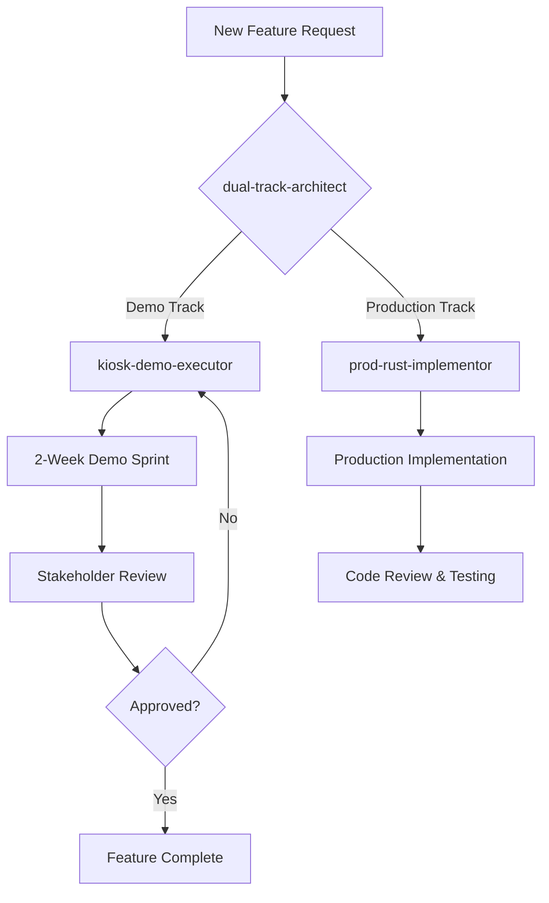

# AI Agent Documentation

This document explains the AI agent architecture used in this project and how the agents work together under the dual-track development methodology.

## 🤖 Agent Overview

The project uses three specialized AI agents, each with specific responsibilities and constraints:

1. **dual-track-architect** - Master orchestrator
2. **kiosk-demo-executor** - Demo track specialist  
3. **prod-rust-implementor** - Production track specialist

## 📋 Agent Responsibilities

### Dual-Track Architect

**Role**: Ensures strict separation between demo and production tracks while coordinating overall development.

**Key Responsibilities**:
- Review all feature assignments to appropriate tracks
- Prevent cross-contamination between tracks
- Approve shared components (exceptional cases only)
- Conduct architecture reviews
- Manage sprint planning

**Decision Authority**:
- Final say on track assignments
- Veto power over cross-track dependencies
- Approval required for timeline extensions

### Kiosk Demo Executor

**Role**: Rapidly prototype and deliver impressive demos within 2-week sprints.

**Key Responsibilities**:
- Build UI-first demonstrations
- Create compelling stakeholder presentations
- Implement with minimal dependencies
- Focus on visual polish over code quality
- Use mock data and simplified flows

**Constraints**:
- Maximum 2-week implementation cycles
- No production dependencies
- Desktop-first approach
- Shortcuts and hard-coding allowed

### Production Rust Implementor

**Role**: Build robust, scalable backend systems with comprehensive testing and documentation.

**Key Responsibilities**:
- Implement production-grade Rust code
- Maintain 80%+ test coverage
- Create language bindings (PyO3)
- Ensure security best practices
- Document all public APIs

**Standards**:
- Zero `unwrap()` in production code
- Comprehensive error handling
- Performance benchmarking
- Memory safety guarantees

## 🔄 Agent Interaction Workflows

### Feature Development Flow



### Cross-Track Communication

1. **Feature Assignment**
   ```yaml
   from: dual-track-architect
   to: [kiosk-demo-executor, prod-rust-implementor]
   payload:
     feature_id: "FEAT-001"
     track: "demo" | "production"
     requirements: [...]
     constraints: [...]
   ```

2. **Status Updates**
   ```yaml
   from: kiosk-demo-executor | prod-rust-implementor
   to: dual-track-architect
   payload:
     status: "in_progress" | "blocked" | "complete"
     completion_percentage: 75
     blockers: [...]
   ```

3. **Approval Requests**
   ```yaml
   from: kiosk-demo-executor
   to: dual-track-architect
   payload:
     request_type: "timeline_extension"
     current_timeline: "14 days"
     requested_timeline: "18 days"
     justification: "..."
   ```

## 🚦 Approval Hierarchies

### Emergency Overrides
Require approval from dual-track-architect:
- Cross-track dependencies
- Timeline extensions beyond limits
- Shared component creation
- Production data in demo

### Automatic Approvals
No approval needed for:
- Mock data creation (demo track)
- UI styling changes (demo track)
- Test additions (production track)
- Documentation updates

## 📊 Agent Performance Metrics

### Dual-Track Architect
- Track isolation violations prevented
- Average approval turnaround time
- Sprint planning accuracy
- Architecture decision quality

### Kiosk Demo Executor
- On-time delivery rate (target: >90%)
- Stakeholder satisfaction score
- Demo-to-production conversion rate
- Average sprint velocity

### Production Rust Implementor
- Test coverage maintained
- Performance regression caught
- API compatibility score
- Documentation completeness

## 🛠️ Working with Agents

### Best Practices

1. **Clear Communication**
   - Provide detailed requirements
   - Specify track explicitly
   - Include acceptance criteria

2. **Respect Boundaries**
   - Don't ask demo agent for tests
   - Don't rush production agent
   - Let architect make track decisions

3. **Efficient Collaboration**
   - Batch related requests
   - Provide context upfront
   - Use agent strengths

### Common Patterns

#### Quick Demo Request
```
To: kiosk-demo-executor
"Create a dashboard showing real-time metrics with animated charts. 
Need it for Friday's board meeting. Mock data is fine."
```

#### Production Feature
```
To: prod-rust-implementor
"Implement secure API endpoint for user authentication with JWT tokens.
Include Python bindings and comprehensive test suite."
```

#### Architecture Review
```
To: dual-track-architect
"Planning to add payment processing. Which track should own this?
Demo needs it for checkout flow, production needs Stripe integration."
```

## 🚨 Escalation Procedures

### When to Escalate to Architect
- Timeline conflicts between tracks
- Shared dependency proposals
- Architecture decision needed
- Track assignment unclear

### Escalation Format
```yaml
escalation:
  from: agent_name
  issue: "Description of the problem"
  impact: "What's blocked or at risk"
  options: 
    - "Option 1 with pros/cons"
    - "Option 2 with pros/cons"
  recommendation: "Suggested solution"
```

## 💡 Tips for Success

### For Demo Track Success
- Start with static mockups
- Focus on the "wow" factor
- Use animations liberally
- Don't overthink the architecture
- Ship early and often

### For Production Track Success
- Design before coding
- Test edge cases thoroughly
- Document as you go
- Benchmark critical paths
- Consider future maintenance

### For Architecture Success
- Keep tracks isolated
- Document all decisions
- Review regularly
- Enforce boundaries strictly
- Plan for scale

## 📝 Agent Configuration Files

Each agent has a covenant file defining its constraints:

- `dual-track-architect.CLAUDE.md` - Orchestration rules
- `kiosk-demo-executor.CLAUDE.md` - Demo track limits
- `prod-rust-implementor.CLAUDE.md` - Production standards

These files are binding contracts that agents must follow.

---

Remember: Agents are tools to enforce methodology. Use them wisely to maintain development discipline while moving fast.